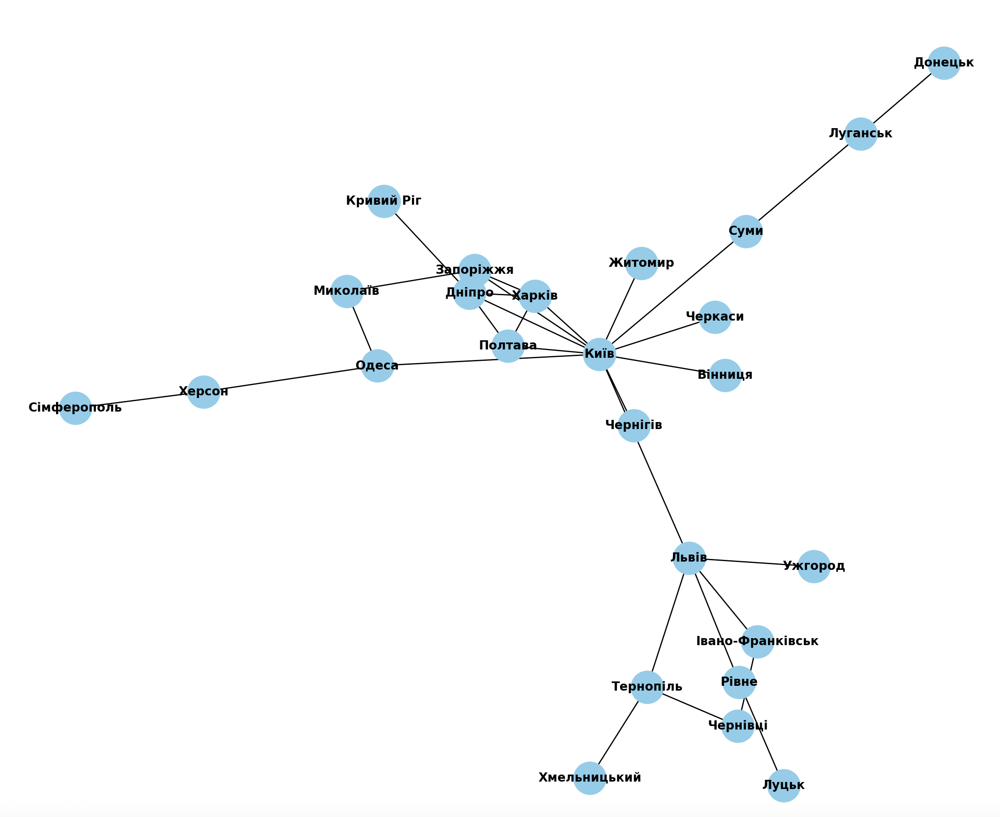

## Setup

- `python -m venv .venv` or `python3 -m venv .venv` to setup virtual environment
- `source .venv/bin/activate` to activate virtual environment on Mac, Linux
- `pip3 install -r requirements.txt` to instal required packages

## Результати

  - **Кількість вершин:** 25
  - **Кількість ребер:** 31
  - **Ступінь кожної вершини:**
    - Київ: 11
    - Харків: 4
    - Одеса: 3
    - Дніпро: 5
    - Донецьк: 1
    - Запоріжжя: 4
    - Львів: 5
    - Кривий Ріг: 1
    - Миколаїв: 2
    - Луганськ: 2
    - Вінниця: 1
    - Сімферополь: 1
    - Херсон: 2
    - Полтава: 3
    - Чернігів: 1
    - Черкаси: 1
    - Суми: 2
    - Житомир: 1
    - Хмельницький: 1
    - Чернівці: 2
    - Рівне: 2
    - Івано-Франківськ: 2
    - Тернопіль: 3
    - Луцьк: 1
    - Ужгород: 1
